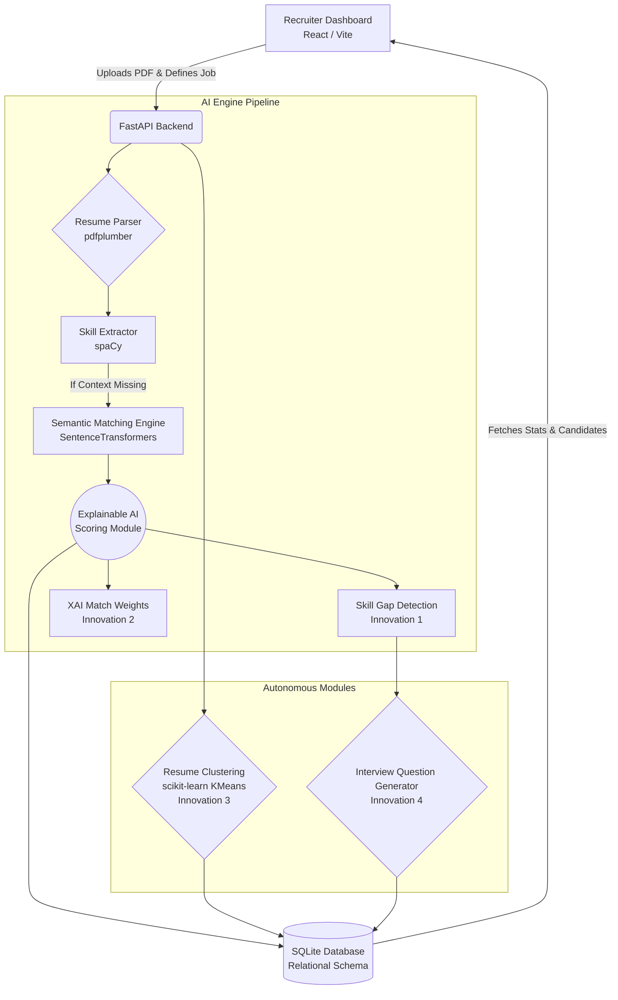

# System Architecture Diagram

```mermaid
graph TD
    A[Recruiter Dashboard<br>React / Vite] -->|Uploads PDF & Defines Job| B(FastAPI Backend)
    
    subgraph AI Engine Pipeline
        B --> C{Resume Parser<br>pdfplumber}
        C --> D[Skill Extractor<br>spaCy]
        D -->|If Context Missing| E[Semantic Matching Engine<br>SentenceTransformers]
        E --> F((Explainable AI<br>Scoring Module))
        F --> G[Skill Gap Detection<br>Innovation 1]
        F --> H[XAI Match Weights<br>Innovation 2]
    end

    subgraph Autonomous Modules
        B --> I{Resume Clustering<br>scikit-learn KMeans<br>Innovation 3}
        G --> J{Interview Question Generator<br>Innovation 4}
    end

    F --> K[(SQLite Database<br>Relational Schema)]
    I --> K
    J --> K
    
    K -->|Fetches Stats & Candidates| A
```
