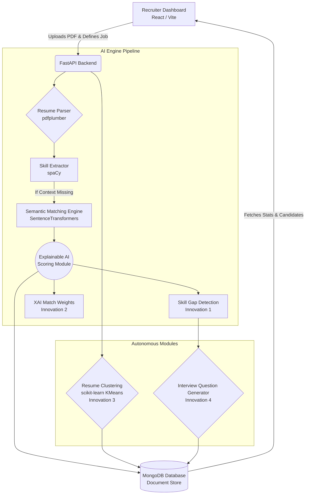

# 🧠 AI-Based Resume Screener & Hiring Intelligence Platform

An end-to-end full-stack solution designed to automate the technical recruitment screening process. Unlike typical "black-box" Applicant Tracking Systems (ATS), this platform prioritizes explainability, semantic understanding, actionable insights, and objective candidate analysis.

## ✨ Key Features

- **📊 Explainable AI Scoring**: Calculates an aggregated scoring metric based on evaluating Skills, Similarity, Experience, Education, and Projects distinctly.
- **🔍 Skill Gap Detection**: Objectively determines missing technical competencies based on Job Requirements vs. Candidate Capabilities.
- **🎯 Dynamic Interview Question Generation**: Seamlessly outputs targeted technical interview questions utilizing the negative space uncovered during the skill gap detection.
- **🧬 Autonomous Resume Clustering**: Implements K-Means Clustering and TF-IDF to categorize large pools of resumes into specific tech stacks (e.g., Data Engineering, Front End Web) without manual oversight.

## 🛠️ Technology Stack

### Front-End
- **Framework:** React (v19) via Vite
- **Styling:** Custom Vanilla CSS (Dark mode optimized)
- **Role:** Recruiter Dashboard for uploading PDFs, defining job criteria, and visualizing candidate metrics and skill gaps.

### Back-End
- **Framework:** FastAPI (Python)
- **Database:** MongoDB (`pymongo`)
- **Role:** Handing REST APIs, concurrent processing, schema validations (`pydantic`).

### Core AI Libraries
- **`pdfplumber`**: Precise text extraction from PDFs.
- **`spaCy`**: Backbone NLP pipeline for entity extraction and linguistic analysis.
- **`sentence-transformers`**: Semantic matching engine (`all-MiniLM-L6-v2`) linking conceptual terminology.
- **`scikit-learn`**: Machine learning for TF-IDF vectorization and K-Means Clustering.

## 🏗️ System Architecture



## 🚀 Getting Started

### Prerequisites
- Node.js (v18+ recommended)
- Python 3.9+
- MongoDB Database Instance

### 1. Backend Setup
Navigate to the `backend` directory and install dependencies:

```bash
cd backend
python -m venv venv
# Activate virtual environment
# On Windows:
venv\Scripts\activate
# On macOS/Linux:
source venv/bin/activate

# Install dependencies
pip install -r requirements.txt
```

Run the FastAPI application:

```bash
uvicorn main:app --reload
```
*The API will be available at `http://localhost:8000`.*

### 2. Frontend Setup
Navigate to the `frontend` directory:

```bash
cd frontend
npm install
npm run dev
```
*The React development server will start, typically on `http://localhost:5173`.*

---
*Built for fair, transparent, and intelligent hiring.*
